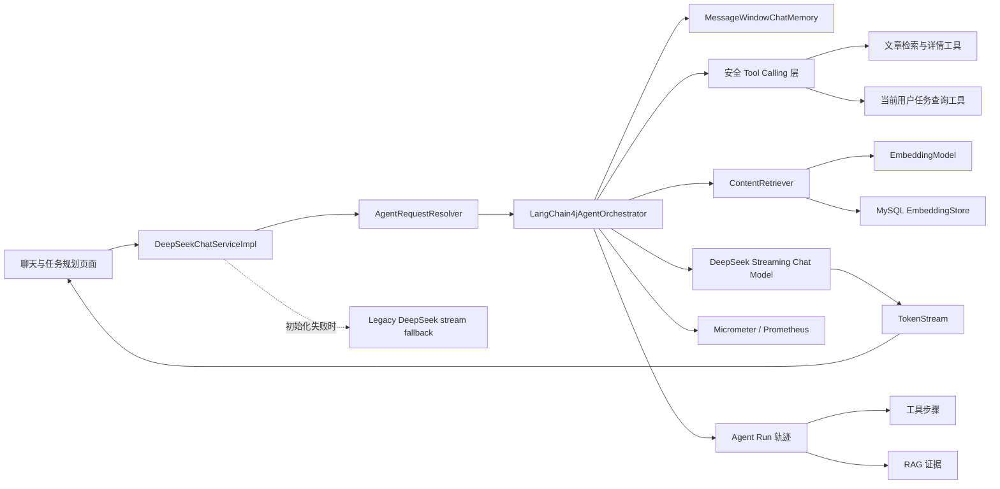

# CodeMate LangChain4j Agent 实战说明

## 项目定位

CodeMate 已从“调用大模型的聊天页面”升级为具备编排、记忆、工具调用、RAG、结构化任务规划、流式输出、降级和可观测能力的 Java Agent 项目。

核心技术栈：Java 17、Spring Boot 2.7、LangChain4j 1.15.1、DeepSeek、MySQL、MyBatis-Plus、Redis、Liquibase、Micrometer/Prometheus、Thymeleaf。

项目仍运行在 Spring Boot 2.7，因此采用 LangChain4j Plain Java API 并由 Spring 手动装配模型和 AI Services，避免为使用新版 Spring Boot Starter 而一次性迁移整个项目到 Jakarta 命名空间。

## 架构



## Agent 模式

| 模式 | 编排能力 | 产物 |
|---|---|---|
| CHAT | 多轮记忆、安全只读工具、流式回答 | Markdown 回答或稳定 JSON 工具结果 |
| BUG_DIAGNOSIS | 专用排障提示词、流式回答 | 原因、证据、修复步骤、验证方案 |
| TASK_PLANNING | 专用结构化提示词、JSON 解析、状态机持久化 | 可执行任务计划 |
| KNOWLEDGE_QA | Embedding、余弦相似度 Top-K、ContentRetriever | 带站内知识上下文的回答 |

同一用户、会话和 Agent 模式组成独立 `memoryId`。会话窗口限制消息数量；同一 `memoryId` 同时只允许一个流式任务，以避免回答交错和记忆污染。

## 配置

不要把真实密钥提交到仓库，使用环境变量：

```text
DEEPSEEK_API_KEY=your-key
DEEPSEEK_API_HOST=https://api.deepseek.com/v1
DEEPSEEK_MODEL=deepseek-chat
LANGCHAIN4J_ENABLED=true
LANGCHAIN4J_FALLBACK_ENABLED=true
AGENT_MEMORY_MAX_MESSAGES=20
AGENT_MAX_TOOL_ROUND_TRIPS=3
AGENT_TOOL_TIMEOUT_MILLIS=3000
AGENT_TOOL_MAX_OUTPUT_CHARS=12000
AGENT_TOOL_MAX_KEYWORD_LENGTH=80
AGENT_TOOL_MAX_ARTICLE_CONTENT_CHARS=6000
AGENT_MAX_RUN_TOOL_CALLS=8
AGENT_MAX_RUN_EXECUTION_SECONDS=180
AGENT_MAX_RUN_TOKEN_BUDGET=16000
AGENT_RUN_SWEEPER_DELAY_MILLIS=10000

RAG_ENABLED=true
EMBEDDING_API_HOST=https://api.openai.com/v1
EMBEDDING_API_KEY=your-embedding-key
EMBEDDING_MODEL=text-embedding-3-small
```

如果聊天模型未配置，现有 DeepSeek 旧链路仍可工作；如果选择知识库问答，则必须同时启用并配置 Embedding 服务。

## 知识库和运维接口

以下接口需要管理员权限：

```text
GET  /api/admin/ai/rag/status
POST /api/admin/ai/rag/index?articleId={articleId}
POST /api/admin/ai/rag/index-all
GET  /api/admin/ai/rag/search?question={question}
```

索引过程会清洗文章正文、按重叠窗口切块、批量生成向量，并原子替换文章旧索引。在线查询将问题向量化，在 MySQL 候选集合中计算余弦相似度，经过阈值过滤后返回 Top-K 文本片段。

Micrometer 指标包括请求量、成功量、失败量、耗时、Token 数、RAG 命中片段数和工具执行结果，可通过项目已有 Actuator/Prometheus 链路采集。工具层额外暴露 `codemate.agent.tool.calls` 与 `codemate.agent.tool.duration`，标签包含工具名、风险等级、结果和错误类型。

## 安全 Tool Calling

当前工具按职责拆为 `ArticleKnowledgeTools` 和 `TaskPlanQueryTools`：

- `searchPublishedArticles`：关键词搜索已发布文章；
- `getPublishedArticle`：按正整数 ID 读取公开文章详情；
- `findPublishedArticlesByCategoryOrTag`：按分类 ID 或标签 ID 检索；
- `listCurrentUserTaskPlans`：查询当前登录用户的计划；
- `getCurrentUserTaskPlan`：查询当前登录用户拥有的指定计划。

所有工具目前均标记为 `READ_ONLY`，风险模型同时预留 `REVERSIBLE_WRITE` 与 `SENSITIVE_WRITE`。工具统一校验参数、限制结果长度、设置超时、转换异常、记录脱敏摘要并返回稳定 JSON。日志只记录工具名、风险、耗时、成功状态和错误类型，不记录关键词、文章正文或任务内容。

任务工具没有 `userId` 参数。编排器将服务端认证得到的用户绑定到 LangChain4j 内部注入的 `memoryId`，工具只读取该可信绑定；缺失登录态、计划不存在或计划不归当前用户时返回安全错误码。公开文章工具继续支持匿名聊天，保持原有聊天兼容性。

## Agent Run 执行轨迹

每次同步或流式 Agent 请求都会创建 `ai_agent_run`。状态机支持 `CREATED`、`PLANNING`、`WAITING_CONFIRMATION`、`EXECUTING`、`COMPLETED`、`FAILED` 和 `CANCELLED`；终态不能被迟到的异步回调覆盖。

工具真正执行前会创建 `ai_agent_step`，记录顺序、工具名、参数哈希摘要、结果摘要、状态、耗时和错误类型。连续使用相同参数调用同一工具会返回 `DUPLICATE_TOOL_CALL`，不会产生第二个重复步骤。达到工具次数、执行时间或 Token 预算后，Run 会进入带明确失败原因的 `FAILED` 终态。后台清理任务会周期性终结超时 Run，避免长期停留在 `EXECUTING`。

RAG 命中通过 `ai_agent_evidence` 保存文章 ID、分块序号、标题、证据摘要和相关度。同一 Run 的同一分块使用数据库唯一约束保证幂等。

登录用户只能查询和取消自己的 Run：

```text
GET /agent-run/api?limit=20
GET /agent-run/api/{runId}
PUT /agent-run/api/{runId}/cancel
```

聊天流式记录中的 `agentRunId` 可直接关联详情接口。工具参数原文不会持久化，日志也不记录问题、工具参数或证据正文。

## Bug 诊断到修复计划

Bug 模式的完整生命周期如下：

1. Run 进入 `EXECUTING`，仅可调用 `READ_ONLY` 工具并记录检索证据；
2. 模型输出结构化诊断，服务端校验字段、长度和置信度；
3. 诊断写入 `ai_bug_diagnosis`，Run 进入 `WAITING_CONFIRMATION`，等待期间不受短执行超时清理器影响；
4. 用户点击“保存为修复计划”，确认接口锁定诊断行，并在同一事务内创建计划、验证/修复/回归步骤和审计；
5. 成功后 Run 经 `EXECUTING` 进入 `COMPLETED`，响应返回 `/task-plan/{planId}`。

任务步骤写工具先锁定 `(planId,userId)` 对应计划，再检查审计幂等键，因此同一计划的并发重试会串行化；归属校验失败时不会执行底层写操作。计划创建使用 `bug-diagnosis:{diagnosisId}` 唯一键，诊断按 `run_id` 唯一。

## 面试可讲的设计取舍

1. 为什么不是简单拼 Prompt：AI Services 把模型、记忆、工具与 RAG 编排统一起来，模式扩展不再修改一个巨型分支。
2. 为什么先用 MySQL 存向量：数据规模可控，部署简单且与文章事务边界一致；数据增大后可平滑迁移到 pgvector、Milvus 或 Elasticsearch 向量检索。
3. 如何防止并发串话：以 `userId:chatId:mode` 隔离记忆，并使用跨线程安全的原子闸门控制同会话并发流。
4. 如何保证可用性：LangChain4j 同步启动失败时可配置回退旧 DeepSeek 流；异步流执行失败则明确结束当前流并记录错误指标。
5. 如何控制幻觉：知识问答只注入检索片段，系统提示要求依据上下文回答；工具仅开放只读、限长的公开文章和本人任务查询能力。

## 可用于简历的描述

> 基于 Java 17、Spring Boot 与 LangChain4j 将技术社区 AI 能力改造成多模式 Agent，接入 DeepSeek 流式模型，设计会话级 ChatMemory、只读 Tool Calling、站内文章 RAG（切块、Embedding、余弦 Top-K）及任务规划状态机；通过并发隔离、旧链路降级与 Micrometer 指标提升稳定性和可观测性。

## 验证命令

```bash
mvn -pl codemate-service -am test
mvn clean install -DskipTests=true
```

第三阶段定向验证：

```bash
mvn -pl codemate-service "-Dtest=BugDiagnosisServiceImplTest,TaskPlanWriteServiceImplTest,AgentRunStateMachineTest,AgentRunServiceImplTest" test
```

第四阶段 RAG 验证：

```bash
mvn -pl codemate-service -am "-Dtest=RagChunkerTest,KnowledgeRagServiceTest,HybridContentRetrieverTest,ArticleRagIndexListenerTest,RagOfflineEvaluatorTest,VectorSimilarityTest" "-Dsurefire.failIfNoSpecifiedTests=false" test
```
