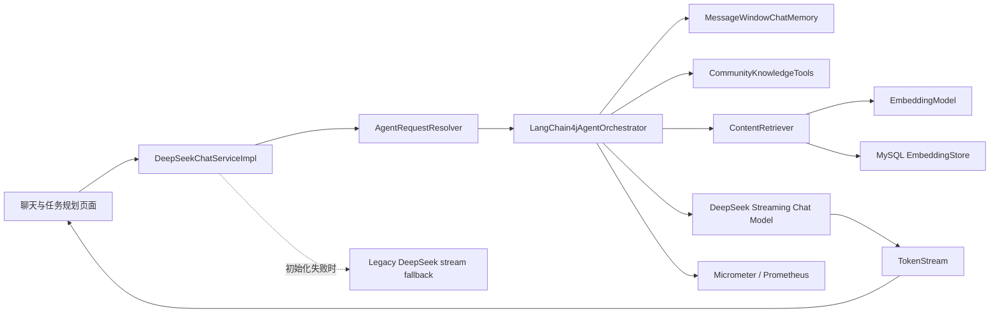

# CodeMate LangChain4j Agent 实战说明

## 项目定位

CodeMate 已从“调用大模型的聊天页面”升级为具备编排、记忆、工具调用、RAG、结构化任务规划、流式输出、降级和可观测能力的 Java Agent 项目。

核心技术栈：Java 17、Spring Boot 2.7、LangChain4j 1.15.1、DeepSeek、MySQL、MyBatis-Plus、Redis、Liquibase、Micrometer/Prometheus、Thymeleaf。

项目仍运行在 Spring Boot 2.7，因此采用 LangChain4j Plain Java API 并由 Spring 手动装配模型和 AI Services，避免为使用新版 Spring Boot Starter 而一次性迁移整个项目到 Jakarta 命名空间。

## 架构



## Agent 模式

| 模式 | 编排能力 | 产物 |
|---|---|---|
| CHAT | 多轮记忆、站内文章搜索工具、流式回答 | Markdown 回答 |
| BUG_DIAGNOSIS | 专用排障提示词、流式回答 | 原因、证据、修复步骤、验证方案 |
| TASK_PLANNING | 专用结构化提示词、JSON 解析、状态机持久化 | 可执行任务计划 |
| KNOWLEDGE_QA | Embedding、余弦相似度 Top-K、ContentRetriever | 带站内知识上下文的回答 |

同一用户、会话和 Agent 模式组成独立 `memoryId`。会话窗口限制消息数量；同一 `memoryId` 同时只允许一个流式任务，以避免回答交错和记忆污染。

## 配置

不要把真实密钥提交到仓库，使用环境变量：

```text
DEEPSEEK_API_KEY=your-key
DEEPSEEK_API_HOST=https://api.deepseek.com/v1
DEEPSEEK_MODEL=deepseek-chat
LANGCHAIN4J_ENABLED=true
LANGCHAIN4J_FALLBACK_ENABLED=true
AGENT_MEMORY_MAX_MESSAGES=20
AGENT_MAX_TOOL_ROUND_TRIPS=3

RAG_ENABLED=true
EMBEDDING_API_HOST=https://api.openai.com/v1
EMBEDDING_API_KEY=your-embedding-key
EMBEDDING_MODEL=text-embedding-3-small
```

如果聊天模型未配置，现有 DeepSeek 旧链路仍可工作；如果选择知识库问答，则必须同时启用并配置 Embedding 服务。

## 知识库和运维接口

以下接口需要管理员权限：

```text
GET  /api/admin/ai/rag/status
POST /api/admin/ai/rag/index?articleId={articleId}
POST /api/admin/ai/rag/index-all
GET  /api/admin/ai/rag/search?question={question}
```

索引过程会清洗文章正文、按重叠窗口切块、批量生成向量，并原子替换文章旧索引。在线查询将问题向量化，在 MySQL 候选集合中计算余弦相似度，经过阈值过滤后返回 Top-K 文本片段。

Micrometer 指标包括请求量、成功量、失败量、耗时、Token 数、RAG 命中片段数和工具执行结果，可通过项目已有 Actuator/Prometheus 链路采集。

## 面试可讲的设计取舍

1. 为什么不是简单拼 Prompt：AI Services 把模型、记忆、工具与 RAG 编排统一起来，模式扩展不再修改一个巨型分支。
2. 为什么先用 MySQL 存向量：数据规模可控，部署简单且与文章事务边界一致；数据增大后可平滑迁移到 pgvector、Milvus 或 Elasticsearch 向量检索。
3. 如何防止并发串话：以 `userId:chatId:mode` 隔离记忆，并使用跨线程安全的原子闸门控制同会话并发流。
4. 如何保证可用性：LangChain4j 同步启动失败时可配置回退旧 DeepSeek 流；异步流执行失败则明确结束当前流并记录错误指标。
5. 如何控制幻觉：知识问答只注入检索片段，系统提示要求依据上下文回答；工具仅开放只读、限长的文章搜索能力。

## 可用于简历的描述

> 基于 Java 17、Spring Boot 与 LangChain4j 将技术社区 AI 能力改造成多模式 Agent，接入 DeepSeek 流式模型，设计会话级 ChatMemory、只读 Tool Calling、站内文章 RAG（切块、Embedding、余弦 Top-K）及任务规划状态机；通过并发隔离、旧链路降级与 Micrometer 指标提升稳定性和可观测性。

## 验证命令

```bash
mvn -pl paicoding-service -am test
mvn clean install -DskipTests=true
```
